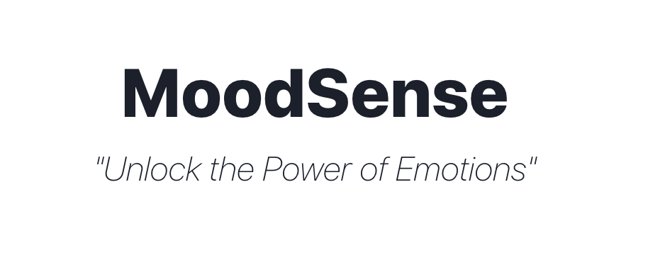

# MoodSense - Mood Tracker Application

MoodSense is a revolutionary mood tracker application that helps you understand and connect with your emotions like never before. It allows you to accurately identify and track your exact mood, providing valuable insights and empowering you to take control of your emotional well-being.

## Key Features
- **Comprehensive Mood Tracking**: Keep a record of your moods over time and gain valuable insights into patterns and trends.
- **Detailed Mood Analysis**: Dive deeper into your emotions with detailed analysis of sub-moods and explore the factors that influence your mood changes.
- **Personalized Recommendations**: Receive personalized suggestions and activities to uplift your mood based on your emotional state.
- **Interactive Data Visualization**: Visualize your mood data through interactive charts and graphs for a clear understanding of your emotional journey.

## Installation

Follow these steps to install and run EmoSense on your local machine:

1. Clone the repository: `git clone https://github.com/fallen-ecstasy/MoodSense.git`
2. Navigate to the project directory: `cd MoodSense`
3. Install the dependencies: `npm install`
4. Start the development server: `npm start`
5. Access EmoSense in your web browser at: `http://localhost:3000`

## Technologies Used

- React
- Chakra UI
- Facial Emotion Recognition API
- Chart.js

## Contributing

We welcome contributions from the open source community to enhance EmoSense. To contribute, follow these steps:

1. Fork the repository.
2. Create a new branch: `git checkout -b feature/my-feature`
3. Make your changes and commit them: `git commit -m 'Add my feature'`
4. Push the changes to your fork: `git push origin feature/my-feature`
5. Submit a pull request to the main repository.

Please ensure that your code adheres to the project's coding standards and includes appropriate documentation and test coverage.

## License

This project is licensed under the MIT License. See the [LICENSE](LICENSE) file for more details.

